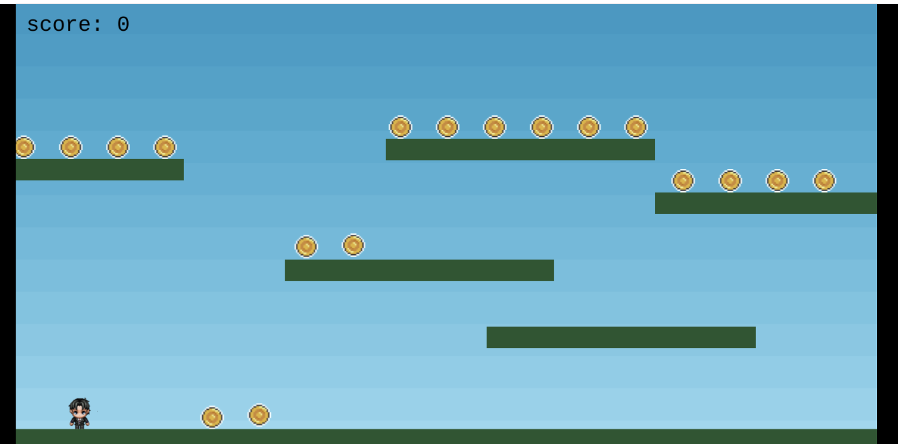

# Endless Platformer

This is an endless platformer game built with Phaser 3 and Next.js. An Arcade game where you collect coins and avoid bombs

### Versions

This project uses:

- [Phaser 3.90.0](https://github.com/phaserjs/phaser)
- [Next.js 15.3.1](https://github.com/vercel/next.js)
- [TypeScript](https://github.com/microsoft/TypeScript)

## Requirements

[Node.js](https://nodejs.org) is required to install dependencies and run scripts via `pnpm`.

## Available Commands

| Command | Description |
|---------|-------------|
| `pnpm install` | Install project dependencies |
| `pnpm run dev` | Launch a development web server |
| `pnpm run build` | Create a production build in the `dist` folder |

## Writing Code

After cloning the repo, run `pnpm install` from your project directory. Then, you can start the local development server by running `pnpm run dev`.

The local development server runs on `http://localhost:8080` by default. Please see the Next.js documentation if you wish to change this, or add SSL support.

Once the server is running you can edit any of the files in the `src` folder. Next.js will automatically recompile your code and then reload the browser.

## Project Structure

We have provided a default project structure to get you started. This is as follows:

| Path | Description |
|---|---|
| `src/pages/_document.tsx` | A basic Next.js component entry point. It is used to define the `<html>` and `<body>` tags and other globally shared UI. |
| `src` | Contains the Next.js client source code. |
| `src/styles/globals.css` | Some simple global CSS rules to help with page layout. You can enable Tailwind CSS here. |
| `src/page/_app.tsx` | The main Next.js component. |
| `src/App.tsx` | Middleware component used to run Phaser in client mode. |
| `src/PhaserGame.tsx` | The React component that initializes the Phaser Game and serves as a bridge between React and Phaser. |
| `src/game/EventBus.ts` | A simple event bus to communicate between React and Phaser. |
| `src/game` | Contains the game source code. |
| `src/game/main.ts` | The main **game** entry point. This contains the game configuration and starts the game. |
| `src/game/scenes/` | The Phaser Scenes are in this folder. `Game.ts` is the main game scene. |
| `public/favicon.png` | The default favicon for the project. |
| `public/assets` | Contains the static assets used by the game. |

We love to see what developers like you create with Phaser! It really motivates us to keep improving. So please join our community and show-off your work 😄

**Visit:** The [Phaser website](https://phaser.io) and follow on [Phaser Twitter](https://twitter.com/phaser_) 
**Play:** Some of the amazing games [#madewithphaser](https://twitter.com/search?q=%23madewithphaser&src=typed_query&f=live) 
**Learn:** [API Docs](https://newdocs.phaser.io), [Support Forum](https://phaser.discourse.group/) and [StackOverflow](https://stackoverflow.com/questions/tagged/phaser-framework) 
**Discord:** Join us on [Discord](https://discord.gg/phaser) 
**Code:** 2000+ [Examples](https://labs.phaser.io) 
**Read:** The [Phaser World](https://phaser.io/community/newsletter) Newsletter 

Created by [Phaser Studio](mailto:support@phaser.io). Powered by coffee, anime, pixels and love.

The Phaser logo and characters are &copy; 2011 - 2025 Phaser Studio Inc.

All rights reserved. 